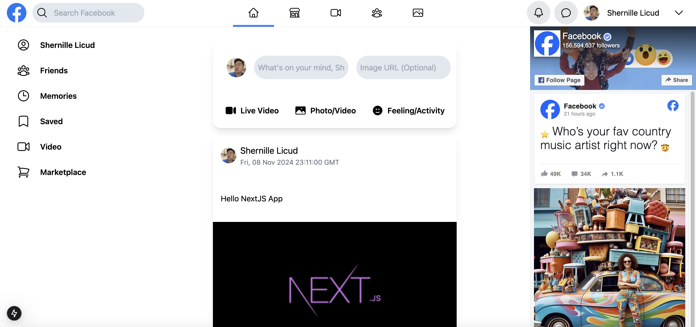

## Facebook Clone

> Facebook Clone where you can post real time with Firebase



## Features
- User authentication with Firebase Google Provider
- Post what in your mind
- Real time post update with Firebase Firestore

## Usage

- Create a [Firebase](https://firebase.google.com/) account with FireStore and obtain your `SECRET KEYS`
  

Add a `.env` file in the `root` and add the following

```
NEXT_PUBLIC_FIREBASE_API_KEY = YOUR FIREBASE API KEY
NEXT_PUBLIC_FIREBASE_AUTH_DOMAIN = YOUR FIREBASE AUTH DOMAIN
NEXT_PUBLIC_FIREBASE_PROJECT_ID = YOUR FIREBASE PROJECT ID
NEXT_PUBLIC_FIREBASE_STORAGE_BUCKET = YOUR FIREBASE STORAGE BUCKET
NEXT_PUBLIC_FIREBASE_MESSAGING_SENDER_ID = YOUR FIREBASE MESSAGING SENDER ID
NEXT_PUBLIC_FIREBASE_APP_ID = YOUR FIREBASE APP ID
NEXT_PUBLIC_FIREBASE_MEASUREMENT_ID = YOUR FIREBASE MEASUREMENT ID
NEXT_PUBLIC_FIREBASE_CLIENT_EMAIL = YOUR FIREBASE CLIENT EMAIL
NEXT_PUBLIC_FIREBASE_PRIVATE_KEY = YOUR FIREBASE PRIVATE KEY

```

### Install Dependencies

```bash
npm install
```

### Run the Development Server

```bash
npm run dev
```

Open [http://localhost:3000](http://localhost:3000) with your browser to see the result.

## License

This project is licensed under the MIT License
